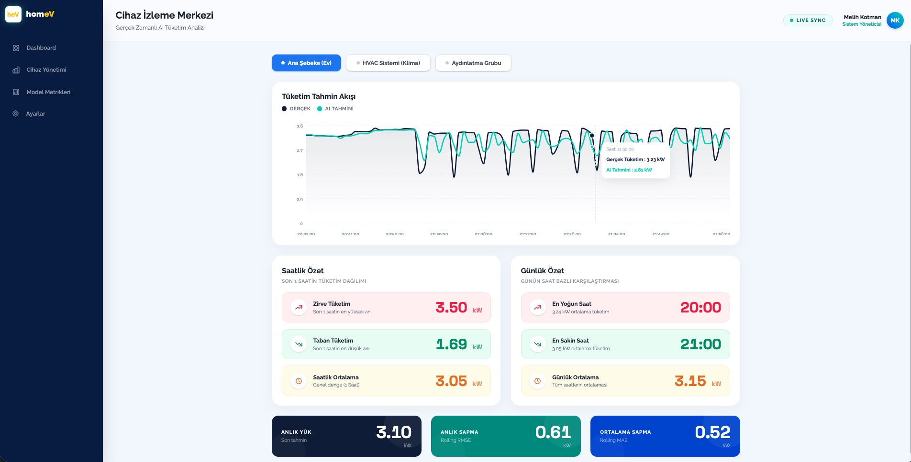
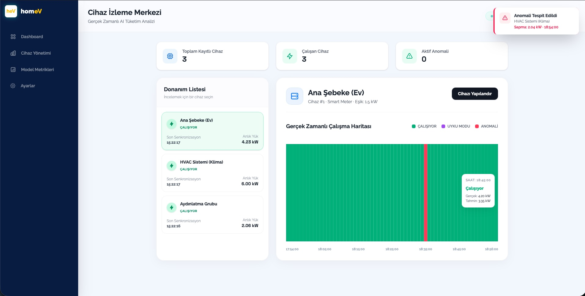
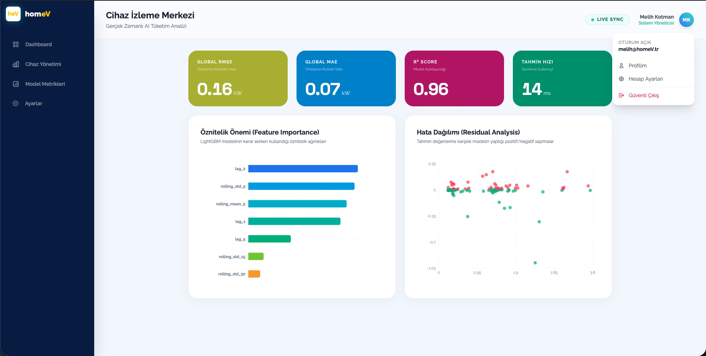
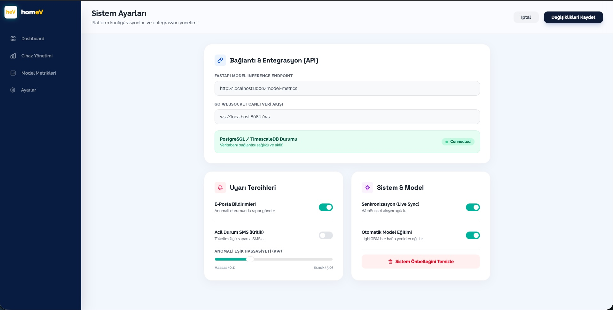

# homeV Energy Forecast Platform

homeV, akıllı sayaç verilerini kullanarak gerçek zamanlı enerji tüketim tahmini yapan, anomali tespiti ve çok sayfalı yönetim arayüzü içeren bir mikroservis mimarisi prototipidir.


## Mimari Özeti

- **Frontend:** Next.js (App Router), Tailwind CSS, Recharts — çok sayfalı SaaS dashboard arayüzü.
- **Backend:** FastAPI (Python), `deque` tabanlı sliding-window buffer ile cihaz bazlı akış verisi yönetimi.
- **Inference Engine:** LightGBM ile zaman serisi tahmini (lag + rolling window özellikleri, log1p dönüşümü).
- **Communication:** WebSocket ile Go API Gateway'den frontend'e gerçek zamanlı veri akışı.
- **Data Collecting:** Go (goroutine'ler ile 3 cihazlı eşzamanlı simülasyon).
- **Database:** PostgreSQL 17 + TimescaleDB (hypertable ile zaman serisi optimizasyonu).
- **Model Metrics & XAI:** LightGBM modelinin iç yapısını sorgulayan yeni endpoint (`/model-metrics`). Gerçek zamanlı `feature_importance` ve model başarısının (R²: 0.96) canlı takibi.
- **Production-Ready DB Entegration:** Model metriklerinin hardcoded değerler yerine doğrudan PostgreSQL/TimescaleDB üzerindeki en güncel 5000 satırlık test verisiyle (canlı feature engineering sonrası) hesaplanması.
- **User Experience:** Avatar dropdown menüsü, profesyonel ayarlar paneli, bildirim şalterleri (toggle), canlı sistem bağlantı durumu ve anomali tespiti için dinamik görselleştirme.

## Sayfalar

### `/` — Ana Dashboard
- Gerçek zamanlı AI tahmin grafiği (Area + Line, tam genişlik)
- Saatlik Tüketim Dağılımı bar grafiği (gradient renklendirme, azdan çoğa)
- Saatlik Özet: DB'den çekilen son 24 saatin en yüksek/en düşük/ortalama saatleri
- Günlük Özet: DB'den çekilen son 7 günün karşılaştırması
- KPI Kartları: Anlık Yük / Anlık Sapma (Rolling RMSE) / Ortalama Sapma (Rolling MAE) — renkli, beyaz yazılı



### `/devices` — Cihaz Yönetimi
- Cihaz listesi: anlık durum (Çalışıyor / Uyku Modu / Anomali), son senkronizasyon zamanı, anlık yük
- Gantt-tipi çalışma haritası: son 2 saatlik aktif/pasif/anomali periyotları
- Anomali tespiti: `|actual - forecast| > threshold` mantığıyla canlı kontrol
- "Cihazı Yapılandır" drawer: cihaz bazında anomali eşiği ayarı (0.1–5.0 kW), tüm cihazlara uygulama seçeneği
- Toast bildirimleri: anomali anında sağ üstte 4 saniyelik uyarı, cihaz adı + sapma miktarı
- Üst bar anomali sayacı: aktif anomali varsa kırmızı badge



### `/analytics` - Model Metrikleri
- KPI Kartları: Global RMSE, MAE, R² Skoru ve Inference Gecikmesi (ms).
- Feature Importance: Modelin kararlarını hangi özniteliklerin (`lag`, `rolling_mean`) yönettiğini gösteren yatay bar grafiği.
- Residual Analysis: Tahmin ile gerçek değer arasındaki sapmaları gösteren interaktif dağılım grafiği.



### `/settings` — Sistem Ayarları
- API/WebSocket endpoint yönetimi, bildirim tercihleri, anomali hassasiyeti ayarları ve sistem önbelleği yönetimi.



## Temel Yetenekler

- **Streaming Feature Engineering:** Gelen her veri noktasında lag (1, 2, 5, 15, 30, 60) ve rolling window (5, 15, 30, 60) özelliklerini canlı hesaplama; model ısınma (61 veri) tamamlanana kadar naive fallback.
- **Rolling Metrik Hesabı:** Her tahmin sonrası hata kaydı, son 30 hata üzerinden canlı RMSE ve MAE hesabı.
- **Anomali Tespiti:** Cihaz bazında ayarlanabilir eşik, WebSocket mesajı geldiğinde anlık kontrol, Gantt grafiğinde kırmızı gösterim.
- **Tarihsel Analiz Endpointleri:** `/hourly-summary/{device_id}` ve `/daily-summary/{device_id}` — DB'deki en son veriden geriye 24 saat / 7 gün agregasyonu.
- **Çok Cihazlı Simülasyon:** 3 farklı profil (çarpan/sapma ile) goroutine'lerle paralel çalışır, her cihazın verisi frontend'de izole tutulur.
- **Font Sistemi:** Raleway (arayüz metinleri) + Space Grotesk (sayısal gösterimler) — tabular-nums + useSmoothValue hook ile pürüzsüz sayı animasyonu.


## Model Performansı

- **Model:** LightGBM Regressor
- **Metrik:** Test setinde RMSE 0.27 kW (ilk 100.000 satırlık alt küme, naive baseline ile karşılaştırmalı)
- **Log Dönüşümü:** `np.log1p` ile hedef değişken normalize edilmiş, tahmin sırasında `np.expm1` ile geri dönüştürülmektedir.

## Bilinen Sınırlamalar

- Model değerlendirmesi tek bir train/test ayrımına dayanmaktadır (cross-validation uygulanmamıştır).
- `naive_fallback` modu, model bulunamadığında veya buffer ısınma sürecindeyken gelen değeri olduğu gibi döndürür — bu bir tahmin değil yer tutucu davranıştır.
- Çok cihazlı simülasyon, gerçek farklı cihazlardan değil tek bir veri kaynağının çarpan/sapma ile türetilmiş kopyalarından oluşmaktadır.
- RMSE 0.27 kW değeri 2 milyon satırlık verinin bir alt kümesinde elde edilmiştir; tam veri setinde yeniden eğitim yapılmamıştır.
- Anomali eşiği frontend state'inde tutulmaktadır; sayfa yenilendiğinde varsayılan değere (1.5 kW) döner.

## Başlatma

```bash
# 1. Veritabanı (PostgreSQL 17 + TimescaleDB çalışıyor olmalı)
psql -d energy_forecast -f db/init.sql

# 2. ML Servisi
cd ml-service
source venv/bin/activate
uvicorn main:app --reload --port 8000

# 3. Go Gateway
cd go-ingestion
go run main.go

# 4. Frontend
cd frontend
npm run dev
```

Sistem `http://localhost:3000` adresinde çalışır.

---
*Melih Yiğit Kotman | 2026*